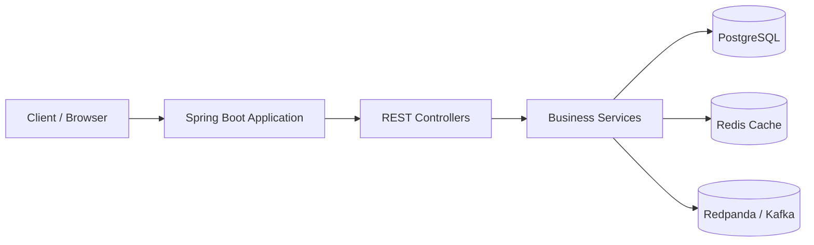
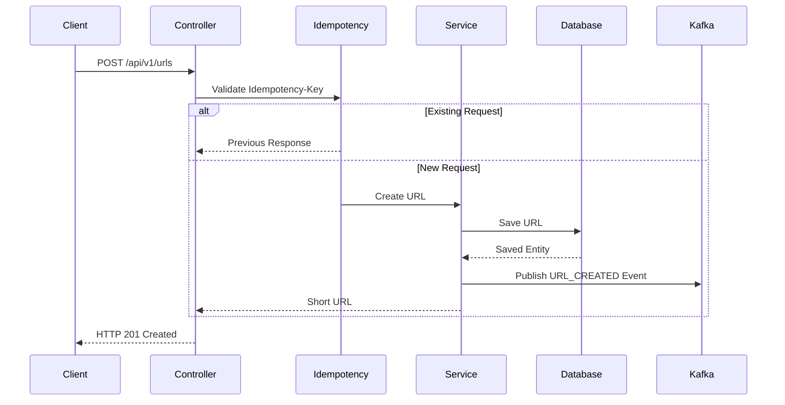
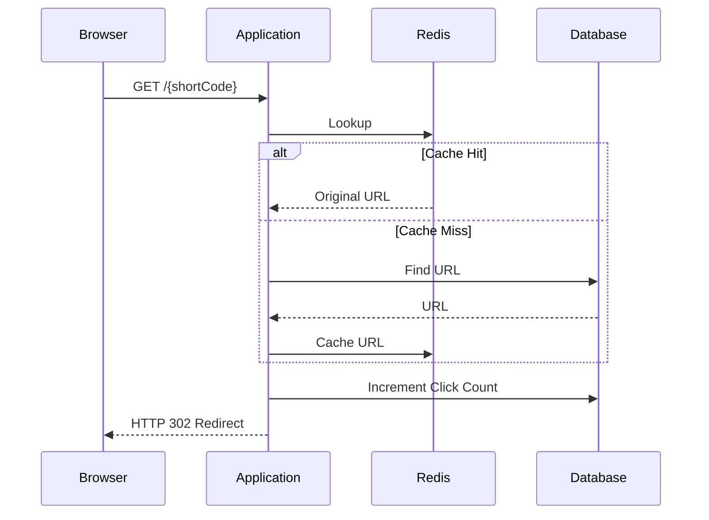
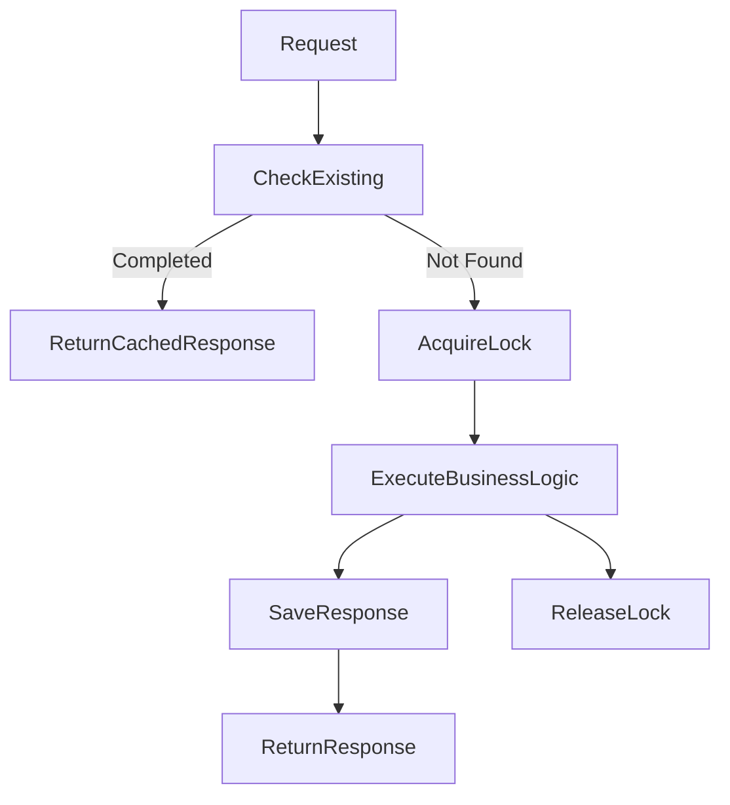

# Agentic URL Shortener Architecture

## Overview

The Agentic URL Shortener is a production-oriented URL shortening service built using Java 21 and Spring Boot. The application demonstrates an event-driven architecture with caching, idempotent request handling, analytics, containerized deployment, and API documentation.

---

# High-Level Architecture



---

# URL Creation Flow



---

# Redirect Flow



---

# Idempotency Flow



---

# Component Responsibilities

| Component | Responsibility |
|-----------|----------------|
| ShortUrlController | REST APIs |
| RedirectController | HTTP Redirects |
| ShortUrlService | Business Logic |
| UrlCacheService | Redis Operations |
| IdempotentUrlCreationService | Duplicate Request Prevention |
| UrlEventPublisher | Kafka Event Publishing |
| Flyway | Database Versioning |

---

# Database

PostgreSQL is the system of record.

Primary table:

```
short_url
```

Stores

- ID
- Short Code
- Original URL
- Created Timestamp
- Expiration Timestamp
- Click Count
- Active Status

---

# Redis

Redis implements the Cache-Aside pattern.

Benefits

- Faster redirects
- Reduced database load
- Lower latency

---

# Kafka Events

Whenever a URL is created, the application publishes an event.

Example

```json
{
  "eventType":"URL_CREATED",
  "shortCode":"AbCd1234",
  "originalUrl":"https://google.com"
}
```

Potential consumers

- Analytics Service
- Audit Service
- Notification Service

---

# Technology Stack

| Layer | Technology |
|--------|------------|
| Language | Java 21 |
| Framework | Spring Boot 4 |
| Database | PostgreSQL |
| Cache | Redis |
| Messaging | Redpanda / Kafka |
| Migration | Flyway |
| Documentation | OpenAPI |
| Containerization | Docker Compose |
| Testing | JUnit 5 + Mockito |

---

# Design Decisions

## Cache Aside

Redis stores frequently accessed URLs while PostgreSQL remains the source of truth.

## Idempotency

Duplicate client requests return the original response instead of creating duplicate URLs.

## Event Driven

Kafka events decouple analytics and future downstream services.

## Docker

All infrastructure can be started with

```bash
docker compose up -d
```

---

# Future Improvements

- Testcontainers Integration Tests
- GitHub Actions CI/CD
- Kubernetes Deployment
- Distributed Click Aggregation
- QR Code Generation
- Custom Aliases
- Authentication
- Rate Limiting
- Micrometer Metrics
- OpenTelemetry Tracing